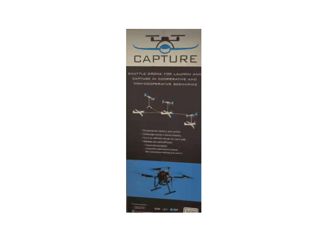

#  RGB-D Document Tracking & Rectification

This repository contains a full pipeline for tracking, rectifying, and cleaning a planar document observed by a moving camera. It was developed as a final project for an Image Processing and Vision course and utilizes both 2D homography estimation and 3D RGB-D depth mappings.

The goal is to accurately map every video frame back to a flat "reference template" view, eventually filtering out occlusions (like hands, bodies, or non-planar objects) using robust geometric vision algorithms built from scratch.



---

##  The Methodology Pipeline

The project is divided into three consecutive phases, moving from pure 2D approximations into robust 3D modeling.

### Part 1: 2D Homography Estimation from RGB Images
In the first phase, the problem is formulated in a 2D setting.
* **Feature Matching:** Used SIFT feature detection and k-nearest neighbors (k=2) combined with Lowe's Ratio Test to find correspondences between frames.
* **Robust Outlier Rejection:** Implemented a custom RANSAC loop (with dynamic iteration calculation) to estimate a 2D Homography Matrix using the Direct Linear Transform (DLT) algorithm.
* **Data Normalization:** Ensured numerical stability using SVD (Singular Value Decomposition) on centered and scaled inliers.

### Part 2: Incorporating Depth Information (RGB-D)
To handle complex camera angles and physical scaling, depth data (`.npy` and `.mat` files) is introduced to convert 2D features into 3D directions.
* **3D Point Extraction:** Extracted 3D points using camera intrinsic matrices ($fx$, $fy$, $cx$, $cy$).
* **Rigid Transformations:** Calculated rotation ($R$) and translation ($t$) matrices between point clouds using custom **Orthogonal Procrustes Analysis**.
* **Optical Flow:** Tracked features across sequential frames using the Lucas-Kanade method (`calcOpticalFlowPyrLK`), filtering out points that demonstrated excessive median motion to guarantee robust tracking.

### Part 3: Out-of-Plane Object Removal
The final module utilizes the rigid 3D transformations obtained in Part 2 to clean the document view.
* **3D Plane Fitting:** Built a 3D RANSAC algorithm to find the dominant plane (the document) in the reference point cloud.
* **Occlusion Masking:** Per-frame point clouds are rotated and translated into the template frame. Any point that falls outside an acceptable threshold distance from the computed document plane is classified as an occlusion (e.g., a hand) and stripped away.
* **Dense Rasterization:** The remaining valid 3D points are re-projected onto the 2D template using z-buffering and splatting, generating a clean, perspective-corrected image free of foreground obstructions.

---

##  Repository Structure

```text
├── part1/
│   ├── main1.py           # SIFT detection and 2D Homography
│   ├── ...                # Image assets and output directories
├── part2/
│   ├── main2.py           # 3D Procrustes Analysis and Optical Flow
│   ├── ...                # Depth mappings and point cloud viz
├── part3/
│   ├── main3.py           # 3D Plane fitting, occlusion removal, and splatting
└── README.md
```

## Prerequisites
The scripts rely heavily on standard scientific computing libraries. Ensure you have the following installed:

```Bash
pip install numpy scipy opencv-python matplotlib pillow
```

## Execution
The code is modularized by project phase. For example, to run the final out-of-plane object removal pipeline (Part 3), use the following terminal command from the root directory:

```Bash
cd part3
python main3.py <path_to_reference_directory> <path_to_sequence_directory> <path_to_output_directory>
```